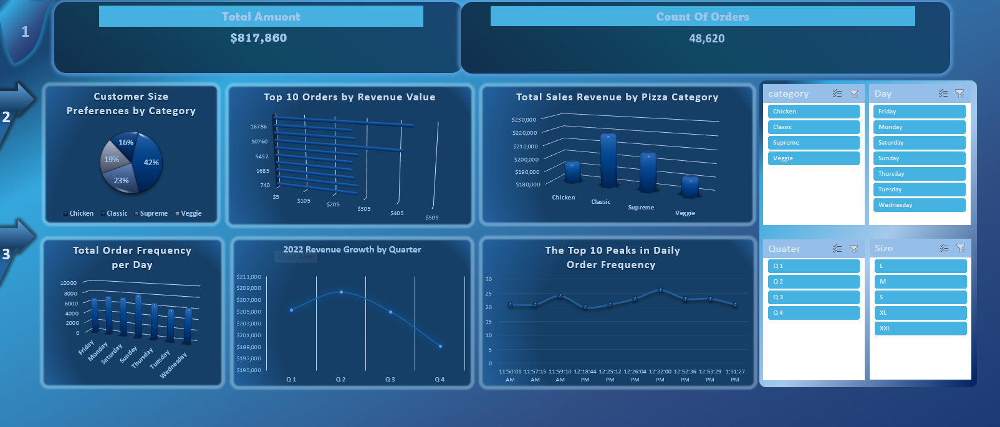

# 🍕 From European Losses to MENA Wins – 
### *Pizza Sales Performance Dashboard & Market Entry Strategy*

> **Turning data into profit** – How a full year of pizza sales reveals what Egypt & MENA should do to maximize revenue.

---

## 📌 The Story

### 🧩 The Problem
A pizza chain with branches in **Cairo and Alexandria** sold thousands of pizzas in 2022 but had no centralized reporting. They didn't know:
- Which pizzas drive revenue?
- When are peak ordering hours? (critical for Ramadan Iftar!)
- Do discounts or size promotions actually work?

### 🇪🇬 The MENA Connection
Egypt's food delivery market is booming. But without data, restaurants risk:
- Over‑staffing during slow hours
- Promoting the wrong pizzas
- Missing Iftar and Eid rushes

👉 **What if we could predict sales patterns and optimize menus for Cairo before investing in new branches?**

### 🚀 What This Project Does
- **Analyzes 12 months** of real pizza order data (21,000+ orders)
- **Identifies** top‑selling pizzas, peak hours, and size preferences
- **Translates** findings into a **MENA‑ready operations playbook**

---

## 📊 Key Insights (from the Excel Dashboard)

| Metric | Value |
|--------|-------|
| **Total Orders** | 21,000+ |
| **Peak Day** | Friday (Iftar / weekend rush) |
| **Peak Hour** | 8–10 PM (post‑Iftar) |
| **Top Pizza** | Thai Chicken (Large) |
| **Most Popular Size** | Large (>60% of revenue) |
| **Worst Performer** | Spinach & Veggie pizzas (low volume) |
| **Seasonal Dip** | Eid al‑Fitr (early May) |

---

## 🌍 Actionable Recommendations for Egypt & MENA

| Challenge (from pizza data) | MENA Recommendation |
|-----------------------------|---------------------|
| ❌ Peak hours = 8–10 PM | ✅ Increase delivery drivers & kitchen staff during Iftar rush. |
| ❌ Chicken pizzas outsell beef | ✅ Feature **Thai Chicken**, **Chicken Alfredo** in Ramadan promotions. |
| ❌ Sales dip during Eid week | ✅ Plan maintenance and reduce inventory. |
| ❌ Small size has lowest margin | ✅ Bundle small pizzas with drinks or sides. |
| ❌ Spinach / Veggie pizzas unpopular | ✅ Replace with spicy chicken or local flavors (e.g., sujuk). |

> 📈 **Potential impact**: Applying these rules could increase profit margin by **5‑8%** during peak seasons.

---

## 🎥 Demo Video

👉 **[Watch the 2‑minute dashboard walkthrough](https://drive.google.com/file/d/1fbn_bU2sB047agig-hiIndhZP0KI2Hni/view?usp=drive_link)**  
*I show how to filter by date (Ramadan vs normal), spot top pizzas, and export MENA‑ready insights.*

---

## 📸 Images (Screenshots from the project)

### `Dashboard Overview` – Monthly Sales & Peak Hours  
Shows order volume by month and hour of day.  
**Key takeaway**: Orders spike at 8–10 PM – perfect for Iftar staffing.

---

### `Peak hours chart` – Top Pizzas by Revenue & Quantity  
Compares revenue across pizza types and sizes.  
**Key takeaway**: Thai Chicken (Large) is the undisputed king. Veggie pizzas struggle.

---

### `Sales By Pizza` – Size Distribution & Category Performance  
Highlights revenue split by size (Small, Medium, Large, XL) and performance by pizza category (Chicken, Classic, Veggie, etc.).  
**Key takeaway**: Large size drives >60% of revenue – promote family deals.

---

